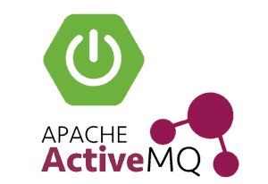

# reactive jms es cqrs app
In progress: Reactive EventSourced CQRS JMS app

<!--

-->


## build, run, test

```bash
# run app
./mvnw spring-boot:run
# subscribe server side events
http --stream :8080/event-stream &
# send messages
http :8080 msg=hello
http :8080 msg=world
```

## api
```bash
$ http :8080
HTTP/1.1 200 OK
Content-Length: 273
Content-Type: application/json;charset=UTF-8
```

```json
{
    "_links": [
        {
            "href": "http://localhost:8080",
            "method": "*",
            "rel": "_self",
            "templated": false
        },
        {
            "href": "http://localhost:8080",
            "method": "POST",
            "rel": "send",
            "templated": false
        },
        {
            "href": "http://localhost:8080/event-stream",
            "method": "GET",
            "rel": "subscribe",
            "templated": false
        }
    ]
}
```

links:

- [Spring Boot JMS](https://docs.spring.io/spring-boot/docs/current/reference/htmlsingle/#boot-features-jms)
